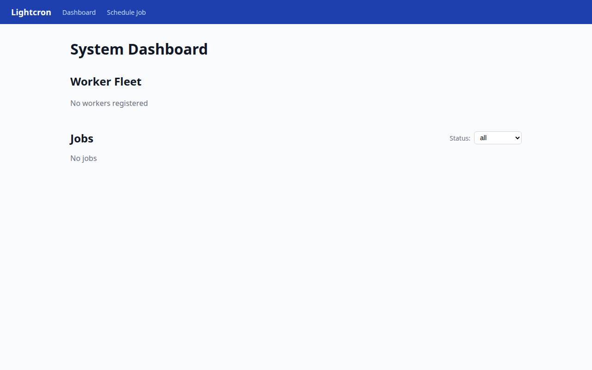
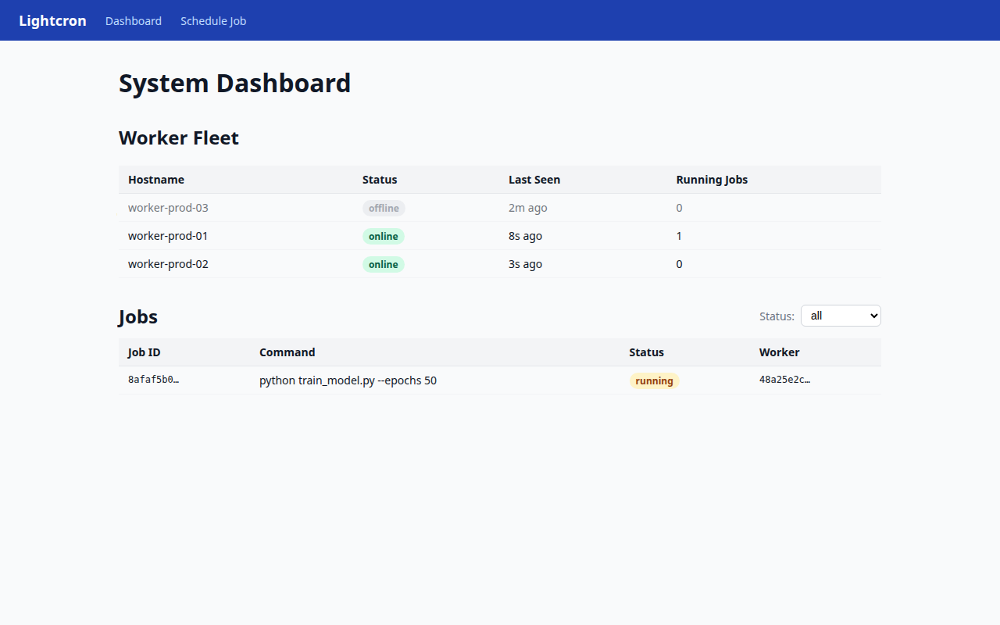
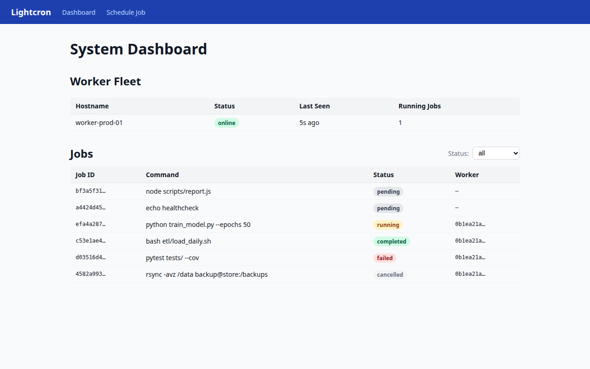
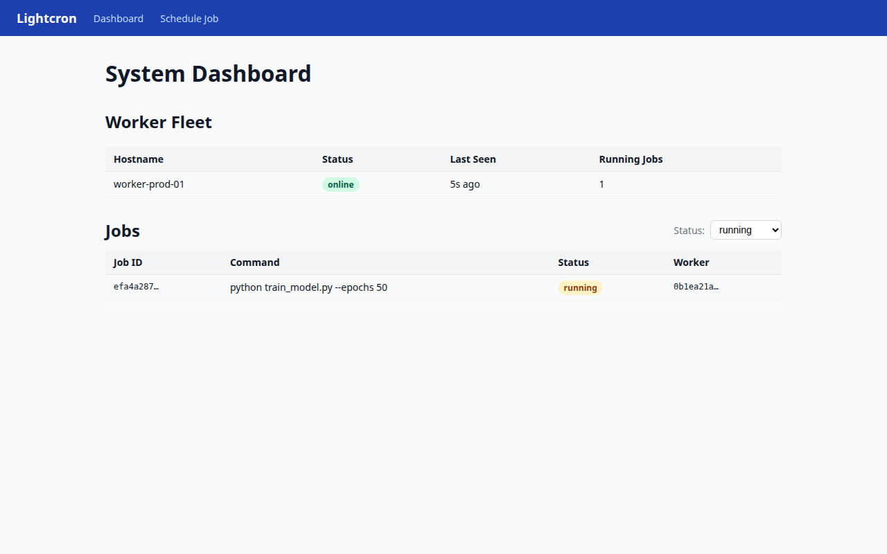
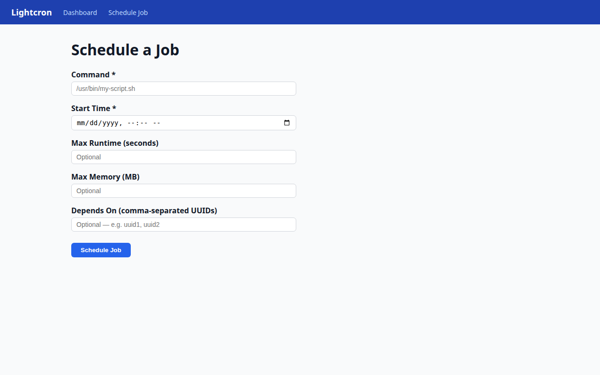
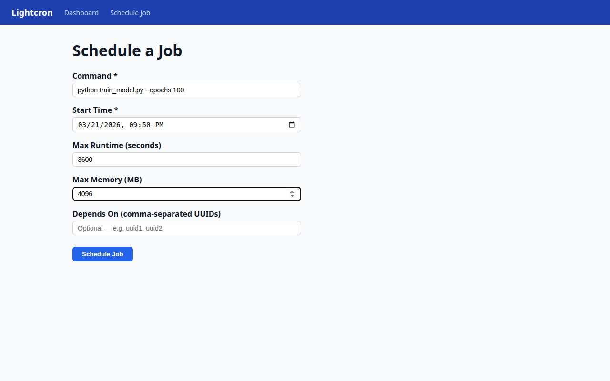
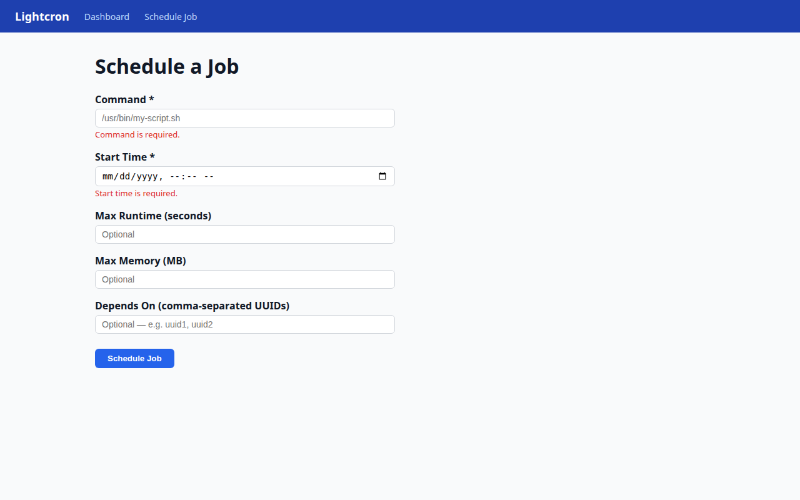
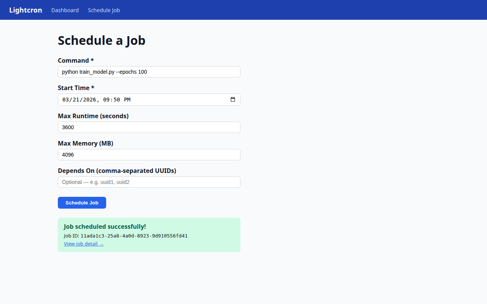

# Lightcron Web UI Guide

The Lightcron web UI is a React single-page application that provides a real-time view of your worker fleet and job queue, and a form for scheduling new jobs.

By default it runs at **http://localhost:5173** and talks to the scheduler API at **http://localhost:8000**.

---

## Navigation

The blue header bar is present on every page and provides two links:

- **Dashboard** — system overview (worker fleet + job list)
- **Schedule Job** — form to submit a new job

---

## Dashboard

The dashboard auto-refreshes every 10 seconds. It has two panels.

### Empty state

When no workers or jobs exist the dashboard shows placeholder messages in each panel.



### Worker Fleet panel

The Worker Fleet table lists every registered worker agent. Each row shows:

| Column | Description |
|--------|-------------|
| **Hostname** | The hostname the worker reported at registration |
| **Status** | `online` (green badge) or `offline` (grey badge) |
| **Last Seen** | Relative time since the worker last sent a heartbeat |
| **Running Jobs** | Count of jobs currently assigned to and running on this worker |

A worker transitions to `offline` automatically when its heartbeat has not been received within the configured threshold.



### Jobs panel

The Jobs table lists jobs from the scheduler, newest first. Each row shows:

| Column | Description |
|--------|-------------|
| **Job ID** | Truncated UUID of the job |
| **Command** | The shell command to be executed (truncated to 80 characters) |
| **Status** | Colour-coded badge (see status reference below) |
| **Worker** | Truncated UUID of the worker assigned to the job, or `–` if unassigned |



#### Job status reference

| Status | Colour | Meaning |
|--------|--------|---------|
| `pending` | Blue | Waiting for its scheduled start time or dependencies |
| `ready` | Blue | Start time reached; waiting to be claimed by a worker |
| `assigned` | Yellow | Claimed by a worker; execution starting |
| `running` | Yellow | Actively executing on a worker |
| `completed` | Green | Finished with exit code 0 |
| `failed` | Red | Finished with a non-zero exit code, or exceeded resource limits |
| `cancelled` | Grey | Cancelled by a user request |
| `lost` | Grey | Worker stopped reporting while job was running |

#### Filtering by status

Use the **Status** dropdown on the right of the Jobs panel header to show only jobs in a specific state. Selecting a status immediately re-fetches the filtered list.



---

## Schedule Job

Click **Schedule Job** in the navigation bar to open the job submission form.



### Fields

| Field | Required | Description |
|-------|----------|-------------|
| **Command** | Yes | The shell command the worker will execute, e.g. `python train.py --epochs 100` |
| **Start Time** | Yes | Earliest time the job may be dispatched. Must be in the future. |
| **Max Runtime (seconds)** | No | Hard upper limit on execution time. The worker sends SIGTERM then SIGKILL if the job exceeds this. |
| **Max Memory (MB)** | No | RSS memory limit. The worker kills the job if it exceeds this. |
| **Depends On (comma-separated UUIDs)** | No | Job IDs that must reach `completed` before this job becomes eligible to run. |

### Filled form example



### Validation

The form validates fields client-side before submitting:

- **Command** is required
- **Start Time** must be set and in the future
- **Max Runtime** and **Max Memory**, if provided, must be positive integers

Server-side errors (e.g. an unrecognised dependency UUID) are displayed inline below the relevant field.



### Success

On successful submission a confirmation banner appears showing the new Job ID. The dashboard will reflect the new `pending` job on its next refresh.



---

## Starting the UI locally

```bash
# Start the backend stack (DB, pgBouncer, scheduler, worker)
docker compose up -d db pgbouncer scheduler worker

# Start the Vite dev server
cd frontend
npm install
npm run dev
```

Then open **http://localhost:5173** in your browser.

For the full stack including the UI in Docker:

```bash
docker compose --profile ui up -d
```
